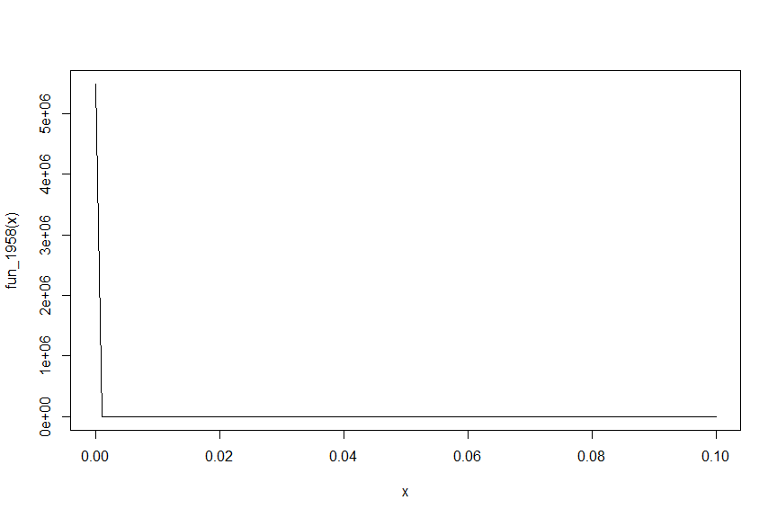
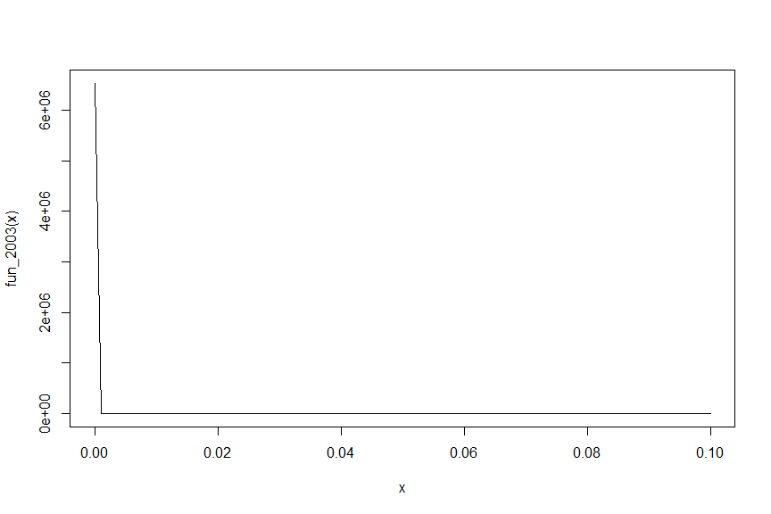

# Pengantar Kesetimbangan $CO_2$ dalam Air Hujan

Tekanan parsial $CO_2$ di atmosfer meningkat setiap tahunnya. Berdasarkan hasil penelitian tekanan parsial $CO_2$ telah berubah dari semula 315 ppm pada tahun 1958 menjadi 376 ppm pada tahun 1958.Perubahan ini mempengaruhi pH air hujan yang jatuh ke bumi disamping adanya pencemaran udara pada kawasan perkotaan dan perindustrian.

pH mengukur aktivitas ion hidrogen dalam air dan dapat dituliskan ke dalam persamaan berikut:

$$
pH = -log_{10}\left[H^+\right]
$$

dimana $\left[H^+\right]$ merupakan molaritas ion hidrogen dalam air.

Dalam air hujan, terdapat 5 persamaan non-linier yang menentukan nilai pH dari air hujan. Berikut adalah persamaan-persamaan tersebut:

$$
K_1=10^6\frac{\left[H^+\right]\left[HCO_3^-\right]}{K_Hp_{CO_2}}
$$

$$
K_2=\frac{\left[H^+\right]\left[CO_3^{2-}\right]}{\left[HCO_3^-\right]}
$$

$$
K_W=\left[H^+\right]\left[OH^-\right]
$$

$$
c_T=\frac{K_Hp_{CO_2}}{10^6}+\left[HCO_3^-\right]+\left[CO_3^{2-}\right]
$$

$$
0\ =\ \left[HCO_3^-\right]+2\left[CO_3^{2-}\right]+\left[OH^-\right]-\left[H^+\right]
$$

dimana $K_H$ = konstanta Henry, dan $K_1$,$K_2$, dan $K_W$ adalah koefisien kesetimbangan dengan nilai dari keempat koefisien tersebut antara lain $10^{-1.46}$, $10^{-6.3}$, $10^{-10.3}$, dan $10^{-14}$. Lima nilai yang tidak diketahui dalam sistem tersebut antara lain $c_T$ = total karbon anorganik, $\left[HCO_3^-\right]$ = bikarbonat, $\left[CO_3^{2-}\right]$ = karbonat, $\left[H^+\right]$ = ion hidrogen, dan $\left[OH^-\right]$ = ion hidroksida.

Dengan menggunakan metode substitusi, kelima persamaan non-linier tersebut dapat dituliskan menjadi persamaan berikut:

$$
0\ =\ \frac{K_1}{10^6\left[H^+\right]}K_Hp_{CO_2}+2\frac{K_1K_2}{10^6\left[H^+\right]}K_Hp_{CO_2}+\frac{K_W}{\left[H^+\right]}-\left[H^+\right]
$$

Dengan menggunakan persamaan tersebut, kita dapat menghitung pH air hujan pada tahun 1958 dan tahun 2003.

# Perhitungan pH Air Hujan

Langkah pertama yang perlu dilakukan untuk menyelesaikan persamaan tersebut adalah memuat paket dan menuliskan nilai-nilai yang diketahui pada permasalahan tersebut.


```r
# ----Memuat library----
library(rootSolve)

# ----Definisikan nilai koefisien atau konstanta----

# Koefisien kesetimbangan
K1 <- 10^(-6.3) # konstanta kesetimbangan Co2
K2 <- 10^(-10.3) # konstanta kesetimbangan bikarbonat
Kw <- 10^(-14) # konstantan kesetimbangan air
Kh <- 10^(-1.46) # konstanta Henry

# Nilai tekanan parsial CO2 tahun 1958 dan 2003

pCO2_1958 <- 315
pCO2_2003 <- 375
```

Tuliskan persamaan terakhir ke dalam sebuah fungsi.


```r
# ----Definisikan fungsi persamaan non-linier ----

fun_1958 <- function(H){
  
  (K1/(10^(6)*H))*Kh*pCO2_1958 + 2*(K1*K2/(10^(6)*H^(2)))*Kh*pCO2_1958 + (Kw/H) - H
}

fun_2003 <- function(H){
  
  (K1/(10^(6)*(H)))*Kh*pCO2_2003 + 2*(K1*K2/(10^(6)*(H^(2))))*Kh*pCO2_2003 + (Kw/H) - H
}
```


Salah satu cara untuk melihat rentang penyelesaian persamaan linier tersebut adalah dengan memvisualisasikan persamaan tersebut.


```r
# ----Mencari akar persamaan melalui visualisasi data----

# 1958
curve(fun_1958, from = 10^(-14) , to = 10^(-1))
```

<!-- -->

```r
# 2003
curve(fun_2003, from = 10^(-14) , to = 10^(-1))
```

<!-- -->

Berdasarkan hasil visualisasi tersebut, kita akan mencoba mencari akar persamaan pada rentang pH 2 sampai 12 menggunakan fungsi `uniroot.all()`.


```r
# ----Mencari akar persamaan melalui fungsi uniroot.all----

# 1958
-log10(uniroot.all(fun_1958, interval = c(10^(-2), 10^(-12))))
```

```
## [1] 4
```

```r
# 2003
-log10(uniroot.all(fun_2003, interval = c(10^(-2), 10^(-12))))
```

```
## [1] 4
```

Berdasarkan hasil perhitungan diketahui bahwa meskipun terjadi peningkatan konsentrasi atau tekanan parsial $CO_2$ di atmosfer, pH air hujan tidak mengalami perubahan yang signifikan.


