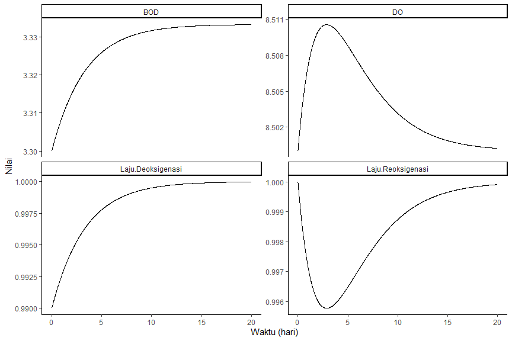

# Pengantar Dinamika Oksigen Terlarut di Perairan

Konsen utama dalam ekosistem perairan adalah tersedianya oksigen terlarut (DO). DO merupakan jumlah molekul oksigen yang terlarut dalam air. DO merupakan merupakan kriteria paling penting dalam penentuan kualitas suatu perairan karena oksigen diperlukan bagi sebagian besar kehidupan perairan.

Secara sederhana jumlah DO dalam perairan dipengaruhi oleh dua hal, yaitu: proses deoksigenasi dan proses reoksigenasi. Untuk menjelaskan kedua proses tersebut, perhatikan gambar berikut:


Pada gambar tersebut kita dapat melihat dua buah kurva, yaitu : kurva DO (garis penuh) dan kurva *biochemical oxygen demand* (garis putus-putus) atau parameter indikator yang menunjukkan jumlah zat organik yang diukur sebagai jumlah oksigen yang dibutuhkan untuk mendegradasi zat organik tersebut. 

Pada kondisi air yang bersih, level DO akan tinggi atau mendekati konsentrasi kelarutan jenuhnya (DO saturasi) dan level *biochemical oxygen demand* (BOD) akan rendah yang menunjukkan tingkat pencemaran perairan yang rendah. Pada kondisi tersebut jumlah DO dan BOD ada pada kondisi setimbang. Kondisi kesetimbangan terjadi ketika laju penggunaan oksigen untuk degradasi zat organik dan laju penambahan oksigen di perairan (reoksigenasi) berada pada level minimum. 

Saat ada limbah organik yang masuk dalam perairan, konsentrasi BOD akan meningkat. Peningkatan konsentrasi BOD akan meningkatkan proses deoksigenasi yang merupakan sebuah fungsi dari konstanta deoksigenasi ($k1$) dan konsentrasi BOD:

$$
Deoksigenasi = k_1 \times BOD
$$

Peningkatan proses deoksigenasi tersebut akan menurunkan konsentrasi DO di perairan karena DO digunakan untuk melakukan proses dekomposisi organik oleh bakteri. Pada saat yang bersamaan DO yang dikonsumsi melalui dekomposisi organik juga bertambah melalui proses reoksigenasi atau aerasi. Laju reoksigenasi bergantung pada seberapa banyak oksigen yang secara teoritis dapat tertahan atau terlarut dalam air. Kondisi itu disebut sebagai kondisi defisit oksigen. Karena DO saturasi ($DO_{sat}$) adalah tingkat kejenuhan teoretis oksigen yang dapat ditampung oleh air dan DO adalah jumlah oksigen yang ada di dalam air, defisit oksigen sama dengan $DO_{sat} - DO$. Jika defisit oksigen besar, maka air akan memiliki kecenderungan yang lebih besar untuk menyerap oksigen dari atmosfer. Jika defisit oksigen kecil, maka oksigen atmosfer akan diserap jauh lebih lambat. Untuk menggambarkan fenomena ini, bayangkan spons cuci piring kering yang ditempatkan di genangan air. Pada awalnya, spons sangat kering dan dengan cepat menarik air ke pori-pori yang terbuka. Saat spons terisi dengan air (misalnya Menjadi jenuh), laju penyerapannya dari genangan air akan berkurang. Pada titik jenuhnya, spons tidak memiliki ruang lagi untuk air tambahan, dan laju penyerapan turun hingga nol. Secara matematis proses reoksigenasi dapat dituliskan sebagai berikut:

$$
Reoksigenasi = \left( DO_{sat} - DO \right) \times k_2
$$

Proses dekomposisi akan terus berlangsung sampai DO menyentuh level minimum dan sistem berada pada kondisi zona septik. Pada kondisi ini defisit oksigen sangat besar dan secara teoritis akan meningkatkan laju reoksigenasi. Disisi lain, penurunan konsentrasi organik terlarut akan menurunkan laju deoksigenasi.

Proses akan berlanjut hingga kondisi kesetimbangan tercapai. Pada kondisi ini konsentrasi DO dan BOD hampir sama dengan konsentrasi saat sebelum adanya pencemaran.

Proses dinamika perubahan konsentrasi DO dan BOD dalam sistem perairan tersebut dapat dituliskan dalam persamaan matematis berikut:

$$
\frac{dBOD}{dt}=Deoksigenasi
$$

$$
\frac{dDO}{dt}=Reoksigenasi - Deoksigenasi
$$

Perlu diperhatikan bahwa dinamika DO yang dijelaskan tersebut adalah bentuk paling sederhana dari dinamika DO yang ada di dunia nyata. Model sistem tersebut mengasumsikan proses deoksigenasi hanya dipengaruhi oleh dekomposisi organik (BOD) dan tidak mempertimbangkan deoksigenasi dari sumber lainnya (misal: oksidasi N dan P). Model juga mengasumsikan penurunan konsentrasi BOD hanya dari proses dekomposisi. Pada kenyataannya terdapat sejumlah cara untuk menurunkan konsentrasi BOD di perairan (misal: pengendapan). Selain asumsi-asumsi tersebut, terdapat sejumlah kekurangan lain dari model yang tidak akan dibahas lebih jauh pada dokumentasi ini karena dokumentasi ini bertujuan untuk mensimulasikan model menggunakan R.

# Studi Kasus

Pada studi kasus ini kita akan membuat sebuah modelsederhana dinamika DO di sungai. Pada model ini tidak ada input pencemar dari kegiatan sekitarnya (misal : industri, pertanian, dll). Input hanya berasal dari input alami organik yang ada di sungai yang berasal dari kelarutan sedimen atau erosi pada dinding sungai.

Misalkan sistem memiliki data-data sebagai berikut:

* BOD awal = 3.33 mg/L
* DO awal = 8.5 mg/L
* DO saturasi = 11.0 mg/L
* $k1$ = 0.30 /hari
* $k2$ = 0.40 /hari
* Input BOD alamiah = 1.0 mg/L

Untuk melakukan simulasi pada R, kita akan menggunakan bantuan paket `desolve` yang menyediakan fungsi-fungsi penyelesaian persamaan diferensial dan paket `tidyverse` yang berisi paket-paket data science.


```r
#-----------Memuat Library-----------

# install.packages(c("desolve", "tidyverse"))

library(deSolve)
library(tidyverse)
```

Selanjutnya kita perlu membuat vektor kondisi awal sistem (*stocks*) dan vektor yang berisikan koefisien atau parameter-parameter eksogen dari sistem.


```r
#----------Spesifikasi Kondisi Awal dan Konstanta----------

stocks <- c(BOD = 3.3, DO = 8.5)
auxs <- c(BODinput = 1, k1 = 0.3, k2 = 0.4, DOsat = 11)
```

Pada studi kasus ini, sistem akan disimulasikan dengan durasi waktu 20 hari dengan besaran step yang digunakan pada perhitungan numerik sebesar 0.01 hari.


```r
#----------Spesifikasi Durasi Simulasi----------

START <- 0
FINISH <- 20
STEP <- 0.01

simtime <- seq(START, FINISH, STEP)
```

Selanjutnya kita perlu mendefinisikan fungsi model berdasarkan persamaan sistem dinamis DO.


```r
#----------Fungsi Dinamika Sistem----------

model <- function(time, stocks, auxs){
  with(as.list(c(stocks, auxs)),{
    
    Deoksigenasi = k1 * BOD
    Reoksigenasi = (DOsat - DO) * k2
    
    dBOD_dt <- BODinput - Deoksigenasi
    dDO_dt <-  Reoksigenasi - Deoksigenasi
    
    return(list(c(dBOD_dt, dDO_dt),
                `Laju Deoksigenasi` = Deoksigenasi,
                `Laju Reoksigenasi` = Reoksigenasi))
  })
}
```

Setelah seluruh tahapan terpenuhi, simulasi dilakukan menggunakan fungsi `ode()` pada paket `desolve`. Hasil simulasi dengan fungsi tersebut dikonversi ke dalam objek dataframe untuk mempermudah penanganan data yang dihasilkan.


```r
#----------Simulasi----------

data <- data.frame(ode(y = stocks, times = simtime,
                   func = model, parms = auxs, method = "euler"))
```


Hasil simulasi selanjutnya divisualisasikan untuk memperoleh gambaran dari sistem.


```r
#----------Visualisasi----------

data %>%
  gather(key = "parameter", value = "konsentrasi",
         -time) %>%
  ggplot(aes(x = time, y = konsentrasi)) +
  geom_line() +
  labs(x = "Waktu (hari)", y = "Nilai") +
  facet_wrap(~parameter, scales = "free_y") +
  theme_classic()
```

<!-- -->

Berdasarkan gambar tersebut, kita dapat melihat bahwa laju deoksigenasi akan meningkat seiring dengan peningkatan konsentrasi BOD, sedangkan laju reoksigenasi akan menurun seiring meningkatnya DO. Hal tersebut disebabkan karena kapasitas penyerapan DO oleh air akan menurun sering konsentrasi DO mendekati titik saturasinya. Kondisi tunak terjadi pada saat pada akhir simulasi dengan kondisi DO mendekati kondisi DO semula dan konsentrasi BOD meningkat menjadi sekitar 3,33 mg/L pada akhir simulasi.
